# Hệ thống đọc truyện online

> **Đồ án tốt nghiệp** - Thành viên thực hiện: Trần Việt Anh

## 📚 I. Giới thiệu

Hệ thống đọc truyện được thực hiện để đáp ứng nhu cầu giải trí người dùng.

Hệ thống được thiết kế theo kiến trúc đảm bảo khả năng phục vụ lưu lượng truy cập đọc lớn (read-heavy)


## II Mô tả kiến trúc tổng quan

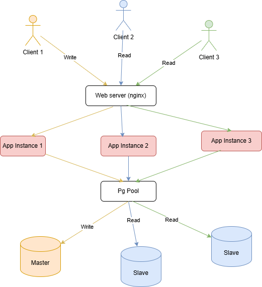

## III. Mô tả một số bài toán đã xử lý

### 1. Xác thực và phân quyền người dùng (RBAC + Token Whitelist)

Hệ thống áp dụng mô hình **RBAC (Role-Based Access Control)** với 3 actor chính:

- **Admin**: quản lý hệ thống, duyệt nội dung
- **Author**: đăng và quản lý truyện/chapter của mình
- **User**: đọc và tương tác nội dung

Quy trình xác thực sử dụng **JWT**, kết hợp với cơ chế **Token Whitelist** để tăng cường bảo mật.  
Mỗi token hợp lệ phải tồn tại trong whitelist, cho phép hệ thống:

- Chủ động **thu hồi token** khi người dùng đăng xuất
- Kiểm soát phiên đăng nhập trên nhiều thiết bị
- Giảm rủi ro khi token bị lộ

Phân quyền được kiểm soát ở cả **route-level** và **business-level**, đảm bảo mỗi actor chỉ có thể truy cập đúng phạm vi chức năng được cấp.

---

###  2. Quy trình đăng truyện có lịch phát hành và kiểm duyệt

Hệ thống hỗ trợ **Author đăng truyện/chapter kèm lịch phát hành (schedule publish)** theo quy trình sau:

1. Author tạo truyện/chapter và thiết lập thời điểm phát hành mong muốn
2. Nội dung được chuyển sang trạng thái **chờ duyệt**
3. **Admin thực hiện kiểm duyệt nội dung** trước khi cho phép phát hành

Để đảm bảo luồng phát hành không bị gián đoạn:
- Nếu **quá thời điểm phát hành đã định mà Admin chưa duyệt**, hệ thống sẽ **tự động gửi thông báo nhắc nhở đến Admin**
- Sau khi Admin duyệt thành công, **thời gian phát hành được tự động cộng thêm 1 ngày**, đảm bảo nội dung vẫn được hiển thị hợp lệ và không bị “miss lịch”

Giải pháp này giúp:
- Tách biệt rõ trách nhiệm Author – Admin
- Tránh tình trạng nội dung bị treo do chậm duyệt
- Giữ trải nghiệm nhất quán cho người đọc

---

### 3.Phân phối nội dung theo chiến lược Explore – Exploit

Hệ thống triển khai bài toán **đề xuất truyện theo chiến lược Explore – Exploit** nhằm cân bằng giữa việc **giữ chân người dùng** và **tăng khả năng khám phá nội dung mới**.

Giải pháp tập trung vào việc **phân phối xen kẽ** giữa:
- **Exploit**: các truyện đang có hiệu suất cao (top view, trending, nhiều tương tác) được ưu tiên để đảm bảo trải nhiệm ổn định
- **Explore**: các truyện mới hoặc ít lượt xem sẽ được phân phối thêm với tỷ lệ hợp lý để tăng tính khám phá

---

## IV. Công nghệ sử dụng

**Frontend:** React.js, TaiwindCSS, Redux Toolkit, React Query

**Backend:**  Spring Boot, Spring Security, Spring Data JPA, Kafka

**Database:** PostgreSQL, MongoDB, Redis

**Tools:** Docker

## V. Một số hình ảnh demo dự án

<table>
  <tr>
    <td>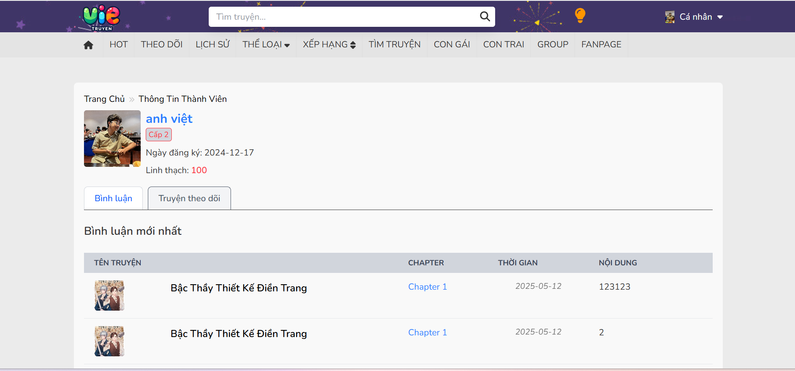</td>
    <td>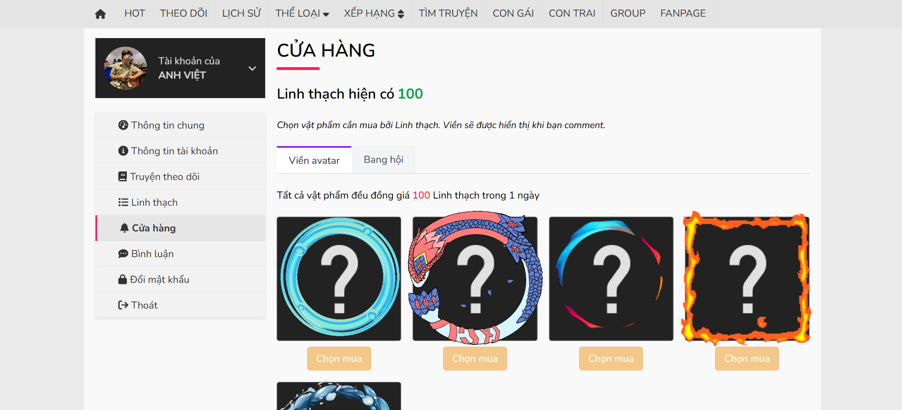</td>
  </tr>
  <tr>
    <td>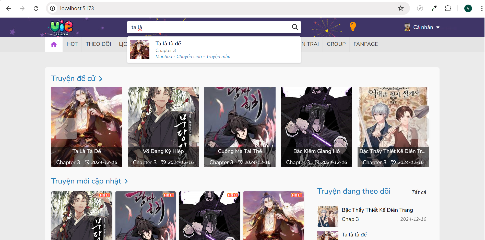</td>
    <td></td>
  </tr>
  <tr>
    <td>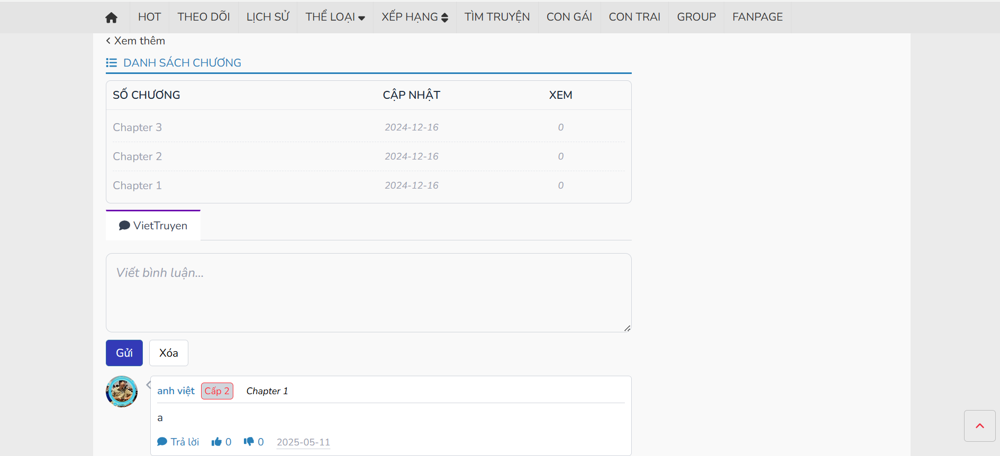</td>
    <td>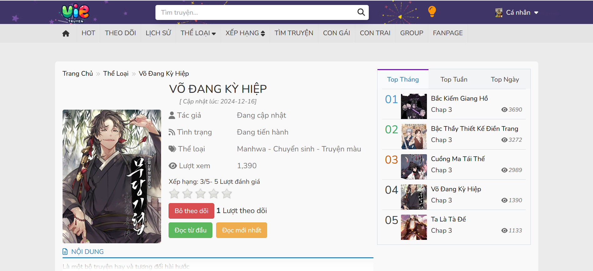</td>
  </tr>
  <tr>
    <td>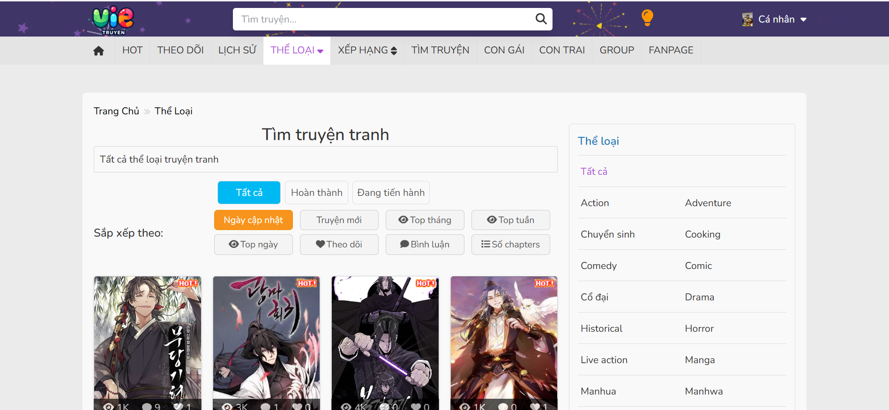</td>
    <td>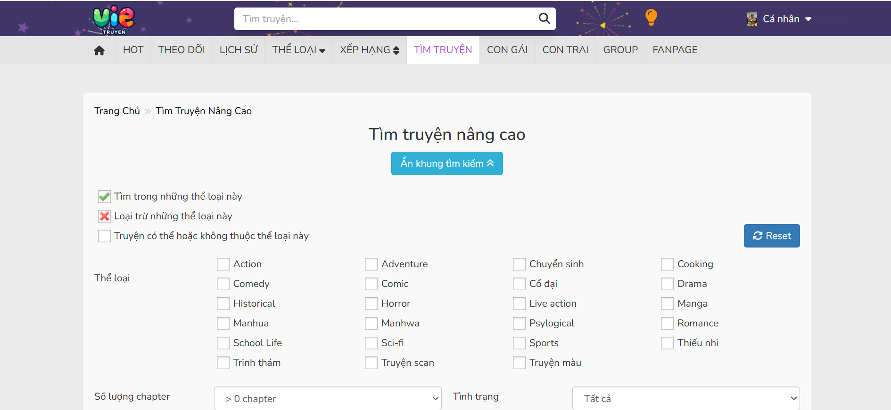</td>
  </tr>
  <tr>
    <td>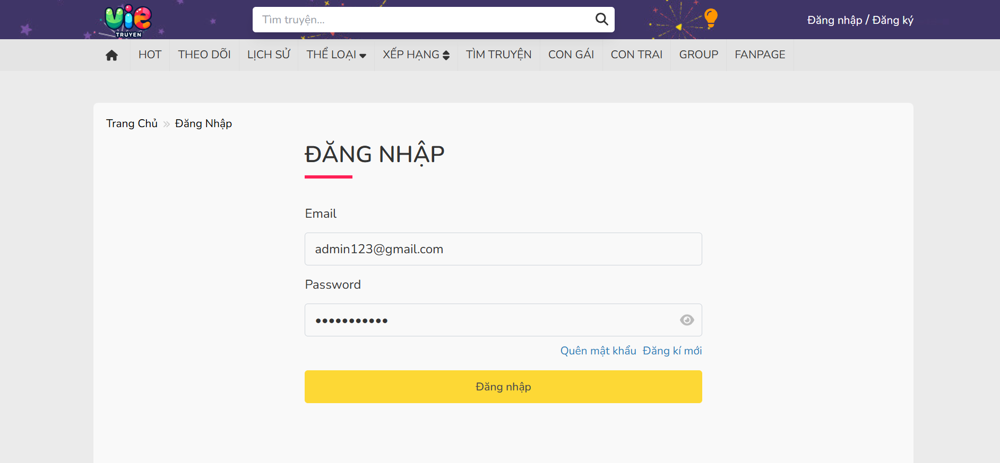</td>
    <td>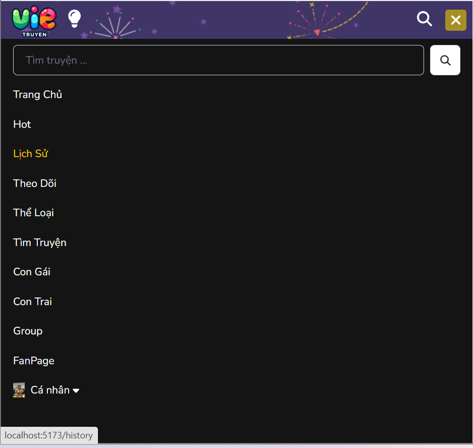</td>
  </tr>
  <tr>
    <td></td>
    <td>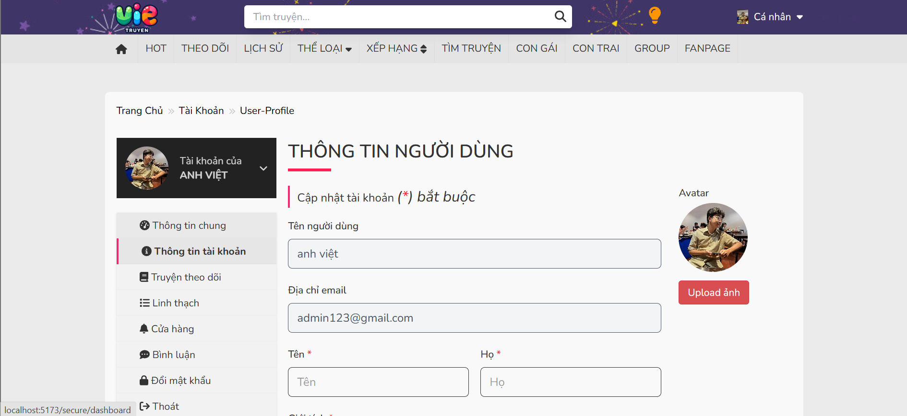</td>
  </tr>
  <tr>
    <td>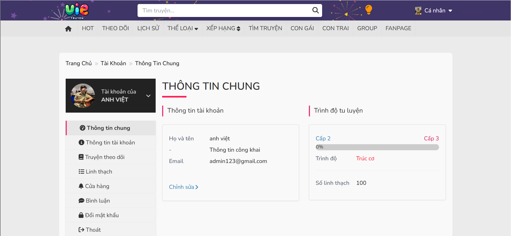</td>
    <td></td>
  </tr>
  <tr>
    <td>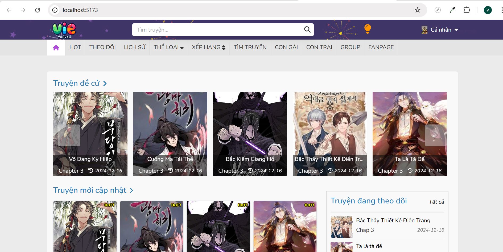</td>
  </tr>
</table>

## ⚙️ VI. Hướng dẫn cài đặt

### Yêu cầu hệ thống
- Docker 4.55.0
- Java JDK 17+
- Maven 3.7+

### Các bước chạy dự án
1. **Clone dự án:**
```
   git clone https://github.com/helloVietTran/reading-comic-system
```
2. **Thiết lập môi trường phát triển:**
```
   cd environment
   docker compose up -d
```

3. **Run backend:**
  
```
   cd backend
   mvn clean install
   mvn spring-boot:run
```

4. **Run frontend:**

```
   cd frontend
   npm install
   npm run dev
```